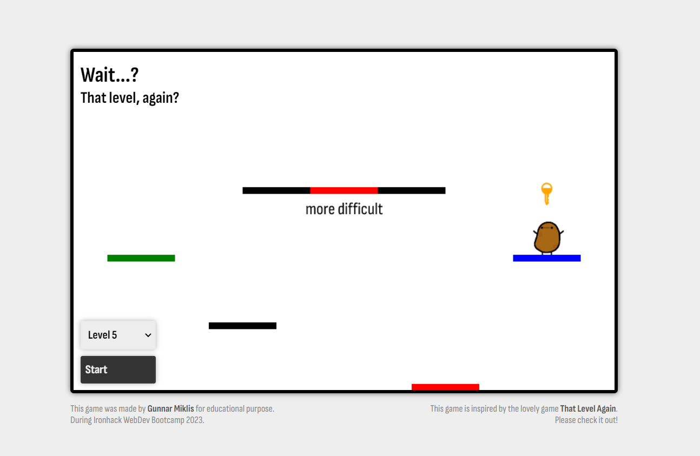

# Wait...? That level, again?

## About
_Navigate the tiny dancin' potato to the exit. But wait? That level... again?_

This game is the final Project for Module-1 Week3 of Ironhack's Web Development Bootcamp 2023. The game was made for education purpose. It's is inspired by the lovely game [That Level Again](https://play.google.com/store/apps/details?id=ru.iamtagir.game.android). Please check it out!

## Project #1 Guidelines: 
### Technical Requirements
Your app must:
1. Render a game in the browser.
2. Have logic for winning and/or losing and show feedback to the player in either case.
3. Include separate HTML / CSS / JavaScript.
4. Use plain JavaScript for DOM manipulation (or HTML canvas for graphics).
5. Have a repo on GitHub.
6. Have at least 1 commit per day that you worked on it.
7. Be deployed online using GitHub Pages so that anybody can play it.
8. Stick with KISS (Keep It Simple Stupid) and DRY (Don’t Repeat Yourself) principles.

### Deliverables
* A working game, built by you that runs in the browser.
* A deploy of your game in GitHub Pages.
* The URL of the GitHub repository for your game.
* The URL of the live game on the Internet.
* The URL of the slides for your game’s presentation.
* You must present your game during Project #1 final presentations (last day of Project #1 time).

## My Code Structure
### index.html
* web page for the p5 canvas
* handling all the js files

### style.css
* general styling, design and layout

### variables.js
* contains all global variables
* contains all global functions
* contains startGame() and nextLevel() function

### sketch.js 
* using p5.js
* initialize canvas and draw
* contains functions for input (keypress, etc.)

### game.js
* class Game()
* initialize game and essential functions

### character.js
* class Char()
* initialize character
* functionality of characters movments

### obstacles.js
* class Obstacles()
* creates basic level with obstacles
* will contain different win-conditions for each level
#### Platform() extends Obstacles()
* initialize platforms
* Method: .standOnPlatform()
#### Key() extends Obstacles()
* initialize platforms
* Method: .collectKey()
#### Exit() extends Obstacles()
* initialize platforms
* Method: .standOnPlatform()
* Method: .win()
#### Trap() extends Obstacles()
* initialize traps 
* Method: .deathOnCollision()

### levels.js
* class Levels()
* contains default level and level events
#### Level() extends Levels()
* many levels with different conditions to win
#### list of level ideas may be here...
* __please add more :)__

### levelCollection.js
* object containing all levels
* also containing relevant properties for each level

## Improvements and Suggestions
* spawn character with each level start ( level.update() ) instead of in general game.draw()
